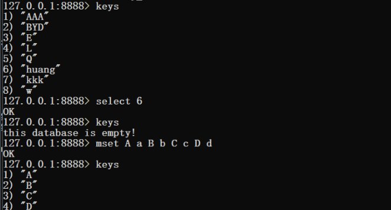

# TinyRedis


## 描述

​	这是一个在windows下使用跳表作为底层数据结构来编写的简易键值型数据库，仿造redis的操作和界面，就暂且称它为tiny redis（实在想不到其它名字了），编写的目的是为了练习socket编程和设计模式。目前项目功能较为单一，只实现了字符串这种数据类型和部分功能。后续有时间会继续完善。


## 编译

使用指令编译(最好是在git的命令行里使用make)

```bash
make
```

## 使用

分别在两个控制台cmd运行

```bash
server.exe
```

```
client.exe
```

在运行client.exe的控制台通过redis常用指令进行操作



## 特性和功能

- 实现了一些简单的功能:set、get、mset、mget等，可在global.h文件中查看
- 每次运行结束后都会将数据保存到磁盘中，默认路径为"data_file/dbxx"，默认创建15个数据库文件

## 项目文件介绍

### global.h

​	用于存放全局变量，登记操作命令。

### SkipList.h

​	跳表类。支持对跳表数据进行增删改查、写入文件和从文件中读入数据的功能。

### RedisHelper.h

​	进行数据库操作的类。

### CommandParser.h

​	进行命令行解析的类，使用了多态的特性，将parse()设置为抽象父类函数，便于后续增加对新的命令行的解析类。

```c++
class CommandParser{
protected:
    static std::shared_ptr<RedisHelper>redisHelper;
public:
    static std::shared_ptr<RedisHelper> getRedisHelper(){return CommandParser::redisHelper;}
    virtual std::string parse(std::vector<std::string>& tokens)=0;//纯虚函数
};
```

### ParserFlyweightFactory.h

​	命令解析类的享元工厂类，使用设计模式中的享元模式，避免了解析器对象的频繁创建和删除。

### FileCreator.h

​	用于在创建保存数据库数据的文件，如果文件已存在，则跳过。

### RedisServer.h

​	实现数据库服务端所需的方法，使用了单例模式进行编写，确保只有一个服务端的实例对象。

### RedisClient.h

​	实现数据库客户端所需的方法。

### server.cpp

​	运行服务端程序。

### client.cpp

​	运行客户端程序。

## 改进和优化

1. 目前数据库的数据类型只支持字符串，还可以增加集合、hash表等。
2. 数据库操作功能不全，可以继续添加功能。
3. 缺少日志系统。
4. 命令行检错需进一步完善。
5. 待补充……

## 参考
SkipList.h 借鉴了项目https://github.com/youngyangyang04/Skiplist-CPP.git的实现。
